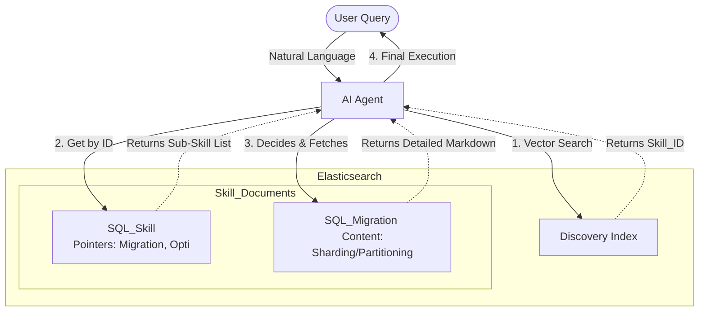

# Cloud Agentic Skill

A **Recursive Agentic Skill Management** system built on Elasticsearch using a **Link-Graph Architecture**. Every skill is a node that can be a leaf (with content) or a branch (pointing to other skills), enabling progressive context loading for AI agents.

---

## Overview

This system provides an intelligent skill management platform where AI agents can discover, navigate, and load skill instructions using semantic search and recursive traversal — without context bloat.

### Key Features

- **Semantic Skill Discovery** — Vector search (kNN) over skill descriptions to find relevant capabilities.
- **Progressive Context Loading** — Agent fetches only summaries initially, drilling into full instructions only when needed.
- **Link-Graph Traversal** — Skills reference sub-skills via pointers, enabling tree-like navigation with O(1) lookups.
- **Database & Model Agnostic** — Clean architecture with Strategy, Repository, and Adapter patterns for easy swapping.
- **MCP Integration** — Exposes skills as Model Context Protocol tools for any compatible Agent (Claude, GPT-4, custom LLMs).
- **Multi-Tenant Access Control** — Hierarchical permissions with JWT scoping and Elasticsearch Document Level Security.
- **Streamlit Dashboard** — Visual management console with a Startup Wizard for zero-config onboarding.

---

## Architecture



---

## Tech Stack

| Component | Technology | Purpose |
|---|---|---|
| **Inference** | Sentence-Transformers (MiniLM / Gemma 2) | Text-to-vector embedding |
| **Database** | Elasticsearch | Vector + Document store |
| **API Layer** | FastAPI | REST API and MCP bridge |
| **UI Layer** | Streamlit | Management dashboard |
| **Agent Bridge** | MCP (Model Context Protocol) | LLM-to-skill connectivity |
| **Containerization** | Docker / Kubernetes | Deployment and orchestration |

---

## Quick Start

### Option A: Docker Compose (recommended)

```bash
git clone <repo-url>
cd cloud-agentic-skill
cp .env.example .env          # adjust settings if needed

docker-compose up -d

# Open the dashboard
open http://localhost:8501
```

### Option B: Local development

```bash
# 1. Start Elasticsearch (Docker or native)
docker run -d --name es -p 9200:9200 \
  -e discovery.type=single-node \
  -e xpack.security.enabled=false \
  docker.elastic.co/elasticsearch/elasticsearch:8.12.0

# 2. Install Python dependencies (uv creates a .venv automatically)
uv sync

# 3. Seed sample data
uv run python -m scripts.seed_data

# 4. Start the FastAPI backend
uv run uvicorn app.main:app --reload

# 5. (in another terminal) Start the Streamlit dashboard
uv run streamlit run dashboard/app.py
```

### Option C: Run tests (no Elasticsearch needed)

```bash
uv sync --dev
uv run pytest tests/ -v
```

---

## API Endpoints

| Method | Path | Auth | Description |
|---|---|---|---|
| `GET` | `/health` | — | System health check |
| `GET` | `/skills/` | — | List all skills |
| `GET` | `/skills/search?q=…` | — | Semantic skill search |
| `GET` | `/skills/{id}` | — | Get skill by ID |
| `GET` | `/skills/{id}/children` | — | Get sub-skills |
| `GET` | `/skills/tree` | — | Full skill tree |
| `POST` | `/skills/` | Admin | Create/update skill |
| `DELETE` | `/skills/{id}` | Admin | Delete skill |
| `POST` | `/auth/login` | — | Get JWT token |
| `POST` | `/auth/register` | Admin | Create user |
| `GET` | `/auth/users` | Admin | List users |
| `POST` | `/api-keys/` | Admin | Generate API key |
| `GET` | `/mcp/tools` | API Key | List MCP tools |
| `POST` | `/mcp/tools/call` | API Key | Invoke MCP tool |

---

## Documentation

Detailed documentation is available in the [`docs/`](docs/) folder:

| Document | Description |
|---|---|
| [Architecture](docs/architecture.md) | System layers, logic flow, and component stack |
| [Data Schema](docs/data-schema.md) | Elasticsearch index mapping and field definitions |
| [Implementation Guide](docs/implementation-guide.md) | Python code for embedding, search, and traversal |
| [Design Patterns](docs/design-patterns.md) | Strategy, Repository, Adapter, and DI patterns |
| [Deployment Guide](docs/deployment-guide.md) | Docker Compose, Kubernetes, and the Startup Wizard |
| [Access Management](docs/access-management.md) | Permissions, multi-tenancy, and MCP authentication |

---

## How It Works

1. **Discovery** — The Agent sends a natural language query. Python encodes it into a vector and performs a kNN search on Elasticsearch to find matching skill IDs and summaries.

2. **Navigation** — The Agent inspects the returned skill's `sub_skills` pointers and reasons about which sub-skill is most relevant to the user's intent.

3. **Targeted Fetch** — The Agent fetches only the specific sub-skill's detailed instructions by ID — an O(1) point lookup — keeping context minimal.

4. **Execution** — The Agent uses the loaded Markdown instructions to perform the task or guide the user.

---

## Project Structure

```
cloud-agentic-skill/
├── README.md
├── pyproject.toml
├── uv.lock
├── docker-compose.yml
├── Dockerfile.backend
├── Dockerfile.dashboard
├── .env.example
├── .gitignore
│
├── app/                          # Python package
│   ├── main.py                   # FastAPI app entry point
│   ├── core/
│   │   ├── config.py             # Pydantic settings
│   │   ├── models.py             # Data models (Skill, User, Token…)
│   │   └── interfaces.py         # Abstract base classes (Strategy/Repository)
│   ├── providers/
│   │   └── embedding.py          # SentenceTransformer & OpenAI providers
│   ├── repositories/
│   │   └── elasticsearch.py      # ES-backed Skill, User, APIKey repos
│   ├── services/
│   │   ├── orchestrator.py       # Skill search-then-traverse logic
│   │   ├── auth.py               # JWT auth + permission inheritance
│   │   └── api_keys.py           # API key CRUD + validation
│   ├── mcp/
│   │   ├── adapter.py            # MCP response formatter
│   │   └── router.py             # MCP tool dispatcher
│   └── api/
│       ├── deps.py               # Dependency injection & auth guards
│       └── routes/
│           ├── skills.py         # /skills endpoints
│           ├── auth.py           # /auth endpoints
│           ├── mcp.py            # /mcp endpoints
│           └── api_keys.py       # /api-keys endpoints
│
├── dashboard/
│   └── app.py                    # Streamlit multi-tab dashboard
│
├── scripts/
│   └── seed_data.py              # Sample skill data loader
│
├── tests/
│   ├── fakes.py                  # In-memory test doubles
│   ├── test_orchestrator.py      # Orchestrator unit tests
│   ├── test_auth.py              # Auth service unit tests
│   ├── test_mcp.py               # MCP adapter/router tests
│   └── test_api.py               # FastAPI integration tests
│
└── docs/
    ├── architecture.md
    ├── data-schema.md
    ├── implementation-guide.md
    ├── design-patterns.md
    ├── deployment-guide.md
    └── access-management.md
```

---

## Design Patterns

The codebase uses four key patterns for maintainability:

| Pattern | File | Purpose |
|---|---|---|
| **Strategy** | `app/core/interfaces.py` → `app/providers/embedding.py` | Swap embedding models without touching business logic |
| **Repository** | `app/core/interfaces.py` → `app/repositories/elasticsearch.py` | Swap database backends (ES → Pinecone, etc.) |
| **Adapter** | `app/mcp/adapter.py` | Translate internal data to MCP/LLM formats |
| **Dependency Injection** | `app/api/deps.py` | Wire everything at startup; override in tests |

---

## License

See [LICENSE](LICENSE) for details.
