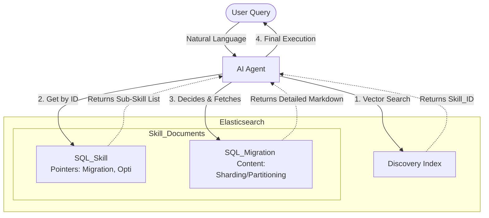

# System Architecture

## Overview

The **Recursive Agentic Skill Management** system uses a **Link-Graph Architecture** built on Elasticsearch. Every skill is treated as a **Node** that can either be a **leaf** (with content/instructions) or a **branch** (pointing to other skills via sub-skill pointers).

---

## High-Level System Layers

The system consists of three distinct layers:

| Layer | Component | Responsibility |
|---|---|---|
| **Discovery Layer** | Elasticsearch | Stores skills in a flat index with relational pointers. Handles Semantic (Vector) search and direct ID lookups. |
| **Orchestration Layer** | The Agent | A logic loop that determines if it has enough information or needs to "drill down" into a sub-skill. |
| **Execution Layer** | The Tool | The actual code or LLM prompt that uses the final "Detailed Instruction" to perform the task. |

---

## Logic Flow: Progressive Disclosure

The Agent follows a **"Zoom-In" pattern** to avoid context bloat:

### Step A: Semantic Search (Casting the Net)

- **Action:** The Agent searches for the user's intent (e.g., "Help me shard my DB").
- **Elasticsearch Query:** Vector search on `skill_desc`.
- **Return:** Just the `skill_id` and a 1-sentence `skill_desc`.
- **Result:** `SQL_SKILL` (The parent).

### Step B: Navigation (Finding the Path)

- **Action:** Agent loads the `SQL_SKILL` document.
- **Source Filter:** `_source: ["sub_skills", "instruction"]`.
- **Agent Logic:** "I see a basic instruction and a list of sub-skills: `SQL_SKILL_MIGRATION`, `SQL_SKILL_OPTIMIZATION`. Since the user mentioned 'sharding', I will fetch `SQL_SKILL_MIGRATION`."

### Step C: Targeted Fetch (The Deep Dive)

- **Action:** Agent fetches the specific sub-skill by ID.
- **Result:** The Agent now receives the heavy Markdown content for sharding/partitioning.
- **Context Usage:** The Agent never saw the "Optimization" instructions, saving hundreds of tokens.

---

## Technical Flow Diagram

---

## Why Elasticsearch Native?

| Feature | Benefit |
|---|---|
| **Point Lookups** | Fetching by `skill_id` is an O(1) operation, making skill traversal near-instant. |
| **Source Filtering** | Use the `_source` parameter to ensure that even large documents only send the `sub_skills` list over the wire initially. |
| **Hybrid Reranking** | If a user's query matches multiple skill descriptions, reranking ensures the most relevant "Entry Point" is chosen first. |

---

## Component Stack

| Component | Technology | Role |
|---|---|---|
| **Inference** | Sentence-Transformers (Gemma 2 / MiniLM) | Text-to-vector conversion |
| **Database** | Elasticsearch | Vector + Document store |
| **API Layer** | FastAPI | Dashboard API and MCP bridge |
| **UI Layer** | Streamlit | Management console |
| **Agent Bridge** | MCP (Model Context Protocol) | Connect the LLM to Python logic |

---

## Backend Architecture

### 1. The Data Pipeline (Ingestion & Vectorization)

Python acts as the **"Factory"** — it reads raw Skill Markdown files, processes them, and pushes them into Elasticsearch.

- **The Logic:** Reads the Skill hierarchy, uses `sentence-transformers` or Hugging Face to generate 384/768-dimension vectors for the `skill_desc`.
- **The Storage:** Uses the Elasticsearch Python Client for bulk upload, ensuring vectors and instruction text are mapped correctly.

### 2. The MCP Tool (The Agent's "Hand")

By implementing the **Model Context Protocol (MCP)**, Python exposes the Skill DB as a "Capability" to the Agent (Claude, GPT-4, or a custom LLM).

- **Skill Discovery Tool:** The Agent calls `find_relevant_skill(query)`. Python runs the vector search and returns a list of Skill IDs.
- **Step Loader Tool:** The Agent calls `load_instruction(skill_id)`. Python fetches the non-indexed `instruction` field for that specific ID.
- **Progressive Context:** The Agent only "sees" what it specifically asks for through the MCP interface.

### 3. The Management Dashboard (UI & API)

Python handles full-stack management of the **"Skill Graph"**:

- **FastAPI (The API):** Provides endpoints for CRUD operations on skills. Exposes the "Search" endpoint used by the MCP tool.
- **Streamlit (The UI):** A dashboard to:
  - Visualize the Skill Tree (using `streamlit-agraph` or similar).
  - Edit instructions in a Markdown editor.
  - Trigger re-indexing/re-vectorization when descriptions change.

---

> **Next:** See [Data Schema](data-schema.md) for the Elasticsearch index mapping details.
