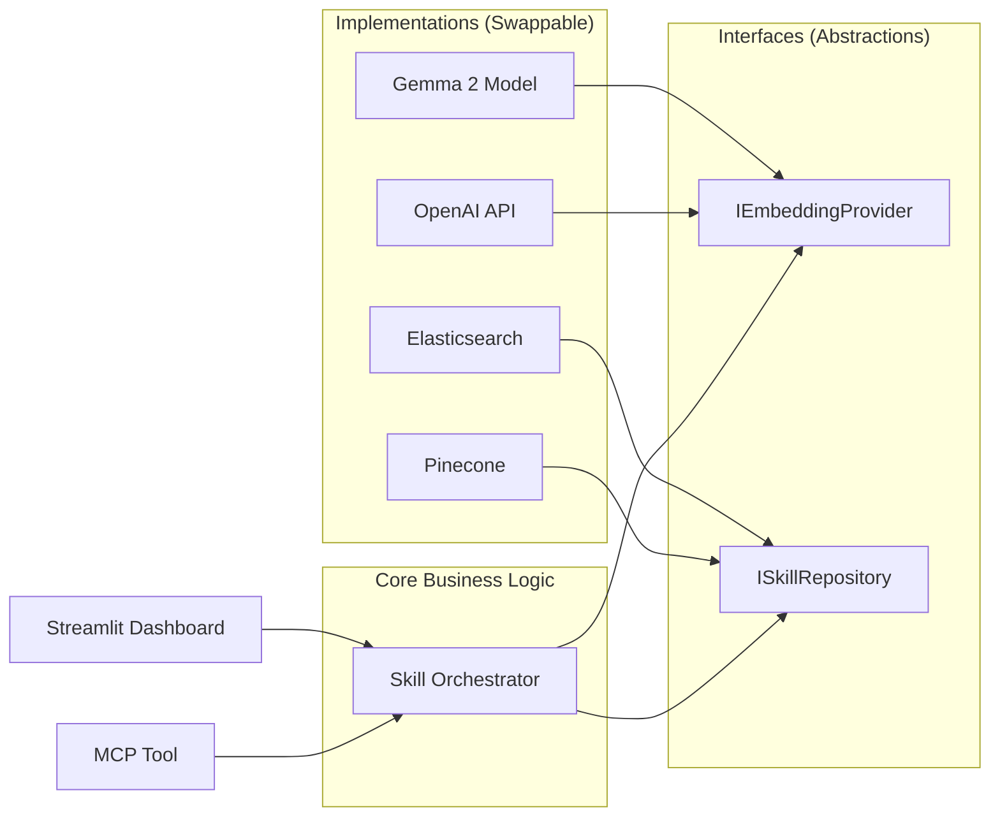

# Design Patterns

## Decoupled "Clean" Architecture

To ensure the Agentic Skill Management system isn't locked into a specific database (like Elasticsearch) or a specific model (like Gemma 2), the system implements a **Decoupled Clean Architecture** using the following design patterns.

> By applying these patterns, you can swap your vector database for Milvus or Pinecone, or your model for OpenAI or Claude, by changing **only a single line of configuration**.

---

## 1. Strategy Pattern (For Embedding Models)

Instead of calling `model.encode()` directly in business logic, define an **Abstract Base Class (ABC)**. This hides the specific model implementation from the rest of the application.

### How It Works

- Create an `EmbeddingProvider` interface.
- Write **Concrete Strategies** for `GemmaProvider`, `OpenAIProvider`, or `SentenceTransformerProvider`.
- Swap the strategy class at runtime to switch models.

### Example

```python
from abc import ABC, abstractmethod
from sentence_transformers import SentenceTransformer


class EmbeddingProvider(ABC):
    """Abstract interface for embedding models."""
    
    @abstractmethod
    def encode(self, text: str) -> list[float]:
        """Convert text to a vector embedding."""
        pass
    
    @abstractmethod
    def get_dimensions(self) -> int:
        """Return the dimensionality of the embedding vectors."""
        pass


class SentenceTransformerProvider(EmbeddingProvider):
    """Concrete strategy using sentence-transformers."""
    
    def __init__(self, model_name: str = 'all-MiniLM-L6-v2'):
        self._model = SentenceTransformer(model_name)
        self._dims = self._model.get_sentence_embedding_dimension()
    
    def encode(self, text: str) -> list[float]:
        return self._model.encode(text).tolist()
    
    def get_dimensions(self) -> int:
        return self._dims


class OpenAIProvider(EmbeddingProvider):
    """Concrete strategy using OpenAI API."""
    
    def __init__(self, api_key: str, model: str = 'text-embedding-3-small'):
        import openai
        self._client = openai.OpenAI(api_key=api_key)
        self._model = model
        self._dims = 1536  # default for text-embedding-3-small
    
    def encode(self, text: str) -> list[float]:
        response = self._client.embeddings.create(input=text, model=self._model)
        return response.data[0].embedding
    
    def get_dimensions(self) -> int:
        return self._dims
```

### Flexibility

If you want to move from local Gemma to a Cloud API, just swap the Strategy class at runtime — no changes to the orchestration or database logic.

---

## 2. Repository Pattern (For Database-Agnostic Storage)

This is the **most critical pattern** for database flexibility. Business logic should never know it's talking to "Elasticsearch." It should only know it's talking to a `SkillRepository`.

### How It Works

- `SkillRepository` defines methods like `.search_by_vector()` or `.get_by_id()`.
- Write concrete implementations: `ElasticsearchRepository`, `ChromaDBRepository`, `PineconeRepository`.
- To switch databases, write a new repository class that implements the same interface.

### Example

```python
from abc import ABC, abstractmethod


class SkillRepository(ABC):
    """Abstract interface for skill storage backends."""
    
    @abstractmethod
    def search_by_vector(self, vector: list[float], k: int = 1) -> list[dict]:
        """Find skills matching a query vector."""
        pass
    
    @abstractmethod
    def get_by_id(self, skill_id: str, fields: list[str] = None) -> dict:
        """Fetch a specific skill by its ID."""
        pass
    
    @abstractmethod
    def upsert(self, skill: dict) -> None:
        """Insert or update a skill document."""
        pass
    
    @abstractmethod
    def ensure_index(self) -> None:
        """Ensure the underlying storage structure exists."""
        pass


class ElasticsearchRepository(SkillRepository):
    """Concrete repository backed by Elasticsearch."""
    
    def __init__(self, es_client, index_name: str = "agent_skills", dims: int = 384):
        self._es = es_client
        self._index = index_name
        self._dims = dims
    
    def search_by_vector(self, vector: list[float], k: int = 1) -> list[dict]:
        response = self._es.search(
            index=self._index,
            knn={
                "field": "skill_desc_vector",
                "query_vector": vector,
                "k": k,
                "num_candidates": k * 10
            },
            _source=["skill_id", "summary", "sub_skills"]
        )
        return [hit['_source'] for hit in response['hits']['hits']]
    
    def get_by_id(self, skill_id: str, fields: list[str] = None) -> dict:
        doc = self._es.get(
            index=self._index,
            id=skill_id,
            _source=fields or True
        )
        return doc['_source']
    
    def upsert(self, skill: dict) -> None:
        self._es.index(
            index=self._index,
            id=skill['skill_id'],
            document=skill
        )
    
    def ensure_index(self) -> None:
        if not self._es.indices.exists(index=self._index):
            self._es.indices.create(index=self._index, body={
                "mappings": {
                    "properties": {
                        "skill_id": {"type": "keyword"},
                        "skill_desc_vector": {
                            "type": "dense_vector",
                            "dims": self._dims,
                            "index": True,
                            "similarity": "cosine"
                        },
                        "summary": {"type": "text", "index": False},
                        "is_folder": {"type": "boolean"},
                        "sub_skills": {"type": "keyword"},
                        "instruction": {"type": "text", "index": False}
                    }
                }
            })
```

---

## 3. Adapter Pattern (For MCP/LLM Integration)

Since different Agents (Claude, GPT-4, local models) expect data in different formats, use an **Adapter** to translate between your internal data model and the Agent's expected format.

### How It Works

- The Adapter takes the raw JSON from your database and "translates" it into the specific Tool/Function call format required by the Model Context Protocol (MCP).
- If the MCP standard updates or you switch to a different Agent framework, you only change the Adapter — not your core database logic.

### Example

```python
class MCPAdapter:
    """Adapts internal Skill data to MCP-compatible tool responses."""
    
    def format_discovery_result(self, skills: list[dict]) -> dict:
        """Format search results for MCP tool response."""
        return {
            "type": "skill_discovery",
            "results": [
                {
                    "id": s['skill_id'],
                    "description": s['summary'],
                    "has_children": bool(s.get('sub_skills'))
                }
                for s in skills
            ]
        }
    
    def format_instruction(self, skill: dict) -> dict:
        """Format a skill's instruction for MCP tool response."""
        return {
            "type": "skill_instruction",
            "skill_id": skill['skill_id'],
            "content": skill.get('instruction', ''),
            "sub_skills": skill.get('sub_skills', [])
        }
```

---

## 4. Dependency Injection (DI) Pattern

This is the **"Glue"** that ties everything together. Instead of hardcoding which model or DB to use inside functions, they are **"injected" at startup**.

### Example

```python
class SkillOrchestrator:
    """Core business logic — depends only on abstractions."""
    
    def __init__(self, embedding: EmbeddingProvider, repository: SkillRepository):
        self._embedding = embedding
        self._repository = repository
    
    def discover_skill(self, user_query: str) -> list[dict]:
        vector = self._embedding.encode(user_query)
        return self._repository.search_by_vector(vector, k=3)
    
    def load_skill(self, skill_id: str) -> dict:
        return self._repository.get_by_id(skill_id, fields=["skill_id", "summary", "sub_skills", "instruction"])


# --- Wiring at startup (FastAPI lifespan, for example) ---
from elasticsearch import Elasticsearch

es_client = Elasticsearch("http://localhost:9200")
embedding = SentenceTransformerProvider('all-MiniLM-L6-v2')
repository = ElasticsearchRepository(es_client, dims=embedding.get_dimensions())
orchestrator = SkillOrchestrator(embedding, repository)
```

---

## Architectural Diagram



---

## Summary

| Pattern | What It Decouples | Swap Example |
|---|---|---|
| **Strategy** | Embedding model | MiniLM → Gemma 2 → OpenAI |
| **Repository** | Database backend | Elasticsearch → Pinecone → ChromaDB |
| **Adapter** | Agent/MCP format | Claude MCP → GPT Function Calling |
| **Dependency Injection** | Wiring / configuration | Change one line at startup |

---

> **Next:** See [Deployment Guide](deployment-guide.md) for Docker, Kubernetes, and the Startup Wizard.
