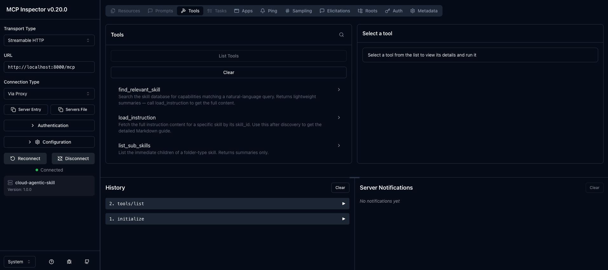

# Onboarding Guide — Real-World Example

This guide walks through a complete end-to-end scenario so you can see exactly how the system works in practice before writing a single line of code.

---

## Scenario

> **You are a backend developer who just joined a team. Your first task is to containerize the Python API, add CI/CD automation, and optimize the slow SQL queries the previous developer left behind. You have no prior knowledge of how the team does any of this.**

Instead of Googling or reading pages of internal wikis, you ask the AI agent — and it finds the right instructions automatically.

---

## Prerequisites

1. Backend running (`docker-compose up -d`)
2. An API key in hand (see [Connecting via MCP](../README.md#connecting-via-mcp))

Set your key once and reuse it throughout:

```bash
export API_KEY="sk-your-key-here"
```

> **All MCP calls use a single endpoint: `POST http://localhost:8000/mcp`**
> This is a JSON-RPC 2.0 server — `mcp-remote`, Claude Desktop, and MCP Inspector all talk to it directly.

### Verify with MCP Inspector (optional but recommended)

```bash
npx @modelcontextprotocol/inspector
```

Enter `http://localhost:8000/mcp` as the server URL and add `X-API-Key: $API_KEY` as a header.



---

## Step 1 — Explore What Skills Exist

Before asking specific questions, get a feel for what the system knows.

```bash
curl http://localhost:8000/skills/tree \
  -H "X-API-Key: $API_KEY" | python3 -m json.tool
```

**Response (trimmed):**
```json
[
  { "skill_id": "DEVOPS_SKILL",  "summary": "DevOps skills — CI/CD, containerization, monitoring, and infrastructure.", "is_folder": true,  "sub_skills": ["DEVOPS_SKILL_DOCKER", "DEVOPS_SKILL_CICD"] },
  { "skill_id": "PYTHON_SKILL",  "summary": "Python programming skills for backend development.",                         "is_folder": true,  "sub_skills": ["PYTHON_SKILL_ASYNC", "PYTHON_SKILL_TESTING"] },
  { "skill_id": "SQL_SKILL",     "summary": "SQL database management, migration, and optimization skills.",              "is_folder": true,  "sub_skills": ["SQL_SKILL_MIGRATION", "SQL_SKILL_OPTIMIZATION"] }
]
```

Three top-level skill groups. Each is a **folder** with child skills inside it.

---

## Step 2 — Discover Skills with Natural Language

Your first task is Docker. Ask in plain English — no need to know any IDs upfront.

```bash
curl -X POST http://localhost:8000/mcp \
  -H "X-API-Key: $API_KEY" \
  -H "Content-Type: application/json" \
  -d '{
    "jsonrpc": "2.0", "id": 1, "method": "tools/call",
    "params": {
      "name": "find_relevant_skill",
      "arguments": { "query": "How do I containerize my Python app using Docker?", "k": 3 }
    }
  }'
```

**Response:**
```json
{
  "jsonrpc": "2.0", "id": 1,
  "result": {
    "content": [
      {
        "type": "text",
        "text": "1. **DEVOPS_SKILL_DOCKER**  (score: 0.940, folder: false)\n   Docker containerization — Dockerfile best practices and multi-stage builds.\n2. **DEVOPS_SKILL**  (score: 0.810, folder: true)\n   DevOps skills — CI/CD, containerization, monitoring, and infrastructure.\n3. **DEVOPS_SKILL_CICD**  (score: 0.720, folder: false)\n   CI/CD pipelines with GitHub Actions and GitLab CI."
      }
    ]
  }
}
```

**What happened:**
- The query was encoded into a vector and matched against all skill descriptions using semantic search (kNN).
- `DEVOPS_SKILL_DOCKER` scored highest (0.94) — it's a leaf skill, so it has the actual instructions.
- `has_children: false` means you can load it directly without further navigation.

---

## Step 3 — Load the Docker Instruction

```bash
curl -X POST http://localhost:8000/mcp \
  -H "X-API-Key: $API_KEY" \
  -H "Content-Type: application/json" \
  -d '{
    "jsonrpc": "2.0", "id": 2, "method": "tools/call",
    "params": {
      "name": "load_instruction",
      "arguments": { "skill_id": "DEVOPS_SKILL_DOCKER" }
    }
  }'
```

**Response:**
```json
{
  "jsonrpc": "2.0", "id": 2,
  "result": {
    "content": [
      {
        "type": "text",
        "text": "# Docker Best Practices\n\n## 1. Multi-Stage Builds\n...\n## 2. Layer Caching\n...\n## 3. Security\n- Run as non-root: `USER 1000`."
      }
    ]
  }
}
```

The agent now has the complete Markdown instructions for Docker — only **one skill's content** was loaded into context, keeping the token footprint minimal.

---

## Step 4 — Navigate a Folder Skill (Optional Drill-Down)

The second search result (`DEVOPS_SKILL`) was a folder. If you weren't sure which sub-skill you wanted, you'd list its children first:

```bash
curl -X POST http://localhost:8000/mcp \
  -H "X-API-Key: $API_KEY" \
  -H "Content-Type: application/json" \
  -d '{
    "jsonrpc": "2.0", "id": 3, "method": "tools/call",
    "params": {
      "name": "list_sub_skills",
      "arguments": { "skill_id": "DEVOPS_SKILL" }
    }
  }'
```

**Response:**
```json
{
  "jsonrpc": "2.0", "id": 3,
  "result": {
    "content": [
      {
        "type": "text",
        "text": "- **DEVOPS_SKILL_DOCKER**: Docker containerization — Dockerfile best practices and multi-stage builds. (leaf)\n- **DEVOPS_SKILL_CICD**: CI/CD pipelines with GitHub Actions and GitLab CI. (leaf)"
      }
    ]
  }
}
```

Now the agent can reason: *"The user asked about Docker, so pick `DEVOPS_SKILL_DOCKER`"* — and then call `load_instruction`.

---

## Step 5 — Tackle the Next Task (SQL Optimization)

Same pattern — ask in plain English:

```bash
curl -X POST http://localhost:8000/mcp \
  -H "X-API-Key: $API_KEY" \
  -H "Content-Type: application/json" \
  -d '{
    "jsonrpc": "2.0", "id": 4, "method": "tools/call",
    "params": {
      "name": "find_relevant_skill",
      "arguments": { "query": "Our SELECT queries are slow, how do I use indexes to speed them up?", "k": 2 }
    }
  }'
```

**Response:**
```json
{
  "jsonrpc": "2.0", "id": 4,
  "result": {
    "content": [
      {
        "type": "text",
        "text": "1. **SQL_SKILL_OPTIMIZATION**  (score: 0.910, folder: false)\n   SQL query tuning, indexing strategies, and performance optimization.\n2. **SQL_SKILL**  (score: 0.780, folder: true)\n   SQL database management, migration, and optimization skills."
      }
    ]
  }
}
```

Load it directly:

```bash
curl -X POST http://localhost:8000/mcp \
  -H "X-API-Key: $API_KEY" \
  -H "Content-Type: application/json" \
  -d '{
    "jsonrpc": "2.0", "id": 5, "method": "tools/call",
    "params": {
      "name": "load_instruction",
      "arguments": { "skill_id": "SQL_SKILL_OPTIMIZATION" }
    }
  }'
```

---

## Full Automated Agentic Loop (Python)

The script below automates the entire workflow — it takes a natural language task, finds the best skill, navigates folders if needed, and returns the final instruction.

```python
"""
onboarding_example.py — Demonstrates the full agentic skill-lookup loop.

Uses the JSON-RPC 2.0 endpoint (POST /mcp) — the same path that
mcp-remote, Claude Desktop, and MCP Inspector use.

Run: python onboarding_example.py
"""
import requests

MCP_URL = "http://localhost:8000/mcp"
API_KEY = "sk-your-key-here"   # replace with your key
HEADERS = {"X-API-Key": API_KEY, "Content-Type": "application/json"}
_rpc_id = 0


def _rpc(method: str, params: dict = {}) -> dict:
    """Send a JSON-RPC 2.0 request and return result."""
    global _rpc_id
    _rpc_id += 1
    r = requests.post(MCP_URL, headers=HEADERS, json={
        "jsonrpc": "2.0", "id": _rpc_id, "method": method, "params": params
    })
    r.raise_for_status()
    body = r.json()
    if "error" in body:
        raise RuntimeError(body["error"]["message"])
    return body["result"]


def call_tool(name: str, arguments: dict) -> str:
    """Call any MCP tool and return the plain-text response."""
    result = _rpc("tools/call", {"name": name, "arguments": arguments})
    return result["content"][0]["text"]


# ── Run three real-world tasks ──────────────────────────────────────────────

# 1. Handshake (required before first tool call)
_rpc("initialize")
print("Handshake OK\n")

tasks = [
    ("find_relevant_skill", {"query": "How do I containerize my Python app using Docker?", "k": 2}),
    ("load_instruction",    {"skill_id": "DEVOPS_SKILL_DOCKER"}),
    ("find_relevant_skill", {"query": "Our SELECT queries are slow, how do I use indexes?", "k": 2}),
    ("load_instruction",    {"skill_id": "SQL_SKILL_OPTIMIZATION"}),
]

for tool, args in tasks:
    print(f"→ {tool}({args})")
    text = call_tool(tool, args)
    print(text[:300] + ("..." if len(text) > 300 else ""))
    print("=" * 60)
```

**Expected Output:**
```
Handshake OK

→ find_relevant_skill({'query': 'How do I containerize my Python app using Docker?', 'k': 2})
1. **DEVOPS_SKILL_DOCKER**  (score: 0.940, folder: false)
   Docker containerization — Dockerfile best practices and multi-stage builds.
2. **DEVOPS_SKILL**  (score: 0.810, folder: true)
   DevOps skills — CI/CD, containerization, monitoring, and infrastructure.
============================================================
→ load_instruction({'skill_id': 'DEVOPS_SKILL_DOCKER'})
# Docker Best Practices

## 1. Multi-Stage Builds
...
============================================================
→ find_relevant_skill({'query': 'Our SELECT queries are slow, how do I use indexes?', 'k': 2})
1. **SQL_SKILL_OPTIMIZATION**  (score: 0.910, folder: false)
   SQL query tuning, indexing strategies, and performance optimization.
...
============================================================
→ load_instruction({'skill_id': 'SQL_SKILL_OPTIMIZATION'})
# SQL Optimization Guide

## 1. Indexing
...
============================================================
```

---

## What You Just Learned

| Concept | What It Means in Practice |
|---|---|
| **JSON-RPC 2.0** | All standard MCP clients talk to `POST /mcp` — one endpoint, method-based routing |
| **Semantic search** | You never need to know a skill ID — a natural language sentence is enough |
| **Folder vs Leaf** | Folders group related skills; leaves hold the actual instructions |
| **Progressive loading** | Only the relevant skill's content enters the agent's context — no bloat |
| **O(1) fetch** | `load_instruction` is a direct document GET — fast regardless of total skill count |
| **MCP compatibility** | Claude Desktop, mcp-remote, MCP Inspector, and custom agents all use the same `POST /mcp` endpoint |

---

## Skill Tree Reference

```
DEVOPS_SKILL  (folder)
├── DEVOPS_SKILL_DOCKER     Docker multi-stage builds, layer caching, security
└── DEVOPS_SKILL_CICD       GitHub Actions, GitLab CI pipelines

PYTHON_SKILL  (folder)
├── PYTHON_SKILL_ASYNC      asyncio, coroutines, TaskGroup
└── PYTHON_SKILL_TESTING    pytest, fixtures, mocking, coverage

SQL_SKILL  (folder)
├── SQL_SKILL_MIGRATION     Sharding, partitioning, schema migrations
└── SQL_SKILL_OPTIMIZATION  Indexing, query tuning, connection pooling
```

---

## Next Steps

- **Add your own skills** — Use the Dashboard (`http://localhost:8501`) or `POST /skills/` to add company-specific skills.
- **Scope API keys** — Restrict an agent key to only `SQL_SKILL` or `DEVOPS_SKILL` via scopes.
- **Integrate with Claude** — See the [Claude Desktop config](../README.md#claude-desktop-integration) section.
- **Read the architecture** — [docs/architecture.md](architecture.md) explains how the vector search and link-graph work under the hood.
